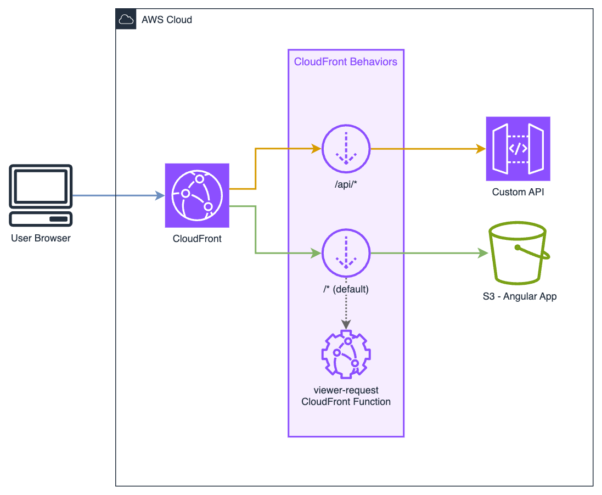
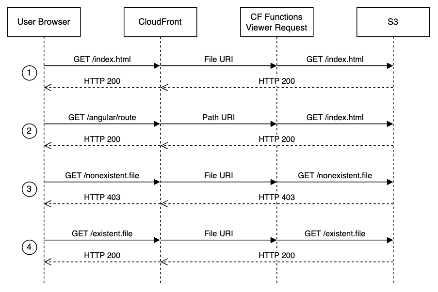

## SPA client side routing


This repository provides a sample CDK App that deploys a simple architecture to demonstrate de use of CloudFront Functions to process SPA routes.

It deploys a simple architecture consisting in a CloudFront Distribution, an S3 Origin wich contains a sample Angular App with two routes and an Custom Origin pointing to an ApiGateway with a sample resource.

This architecture includes a CloudFront Function that is executed in CloudFront's _Viewer Request_ behavior if the S3 origin to re-write route requests for SPA Applications.



## Why?

S3 origins lack the ability to route SPA requests correctly to `/index.html`. 

The usual approach to solve this problem is to configure distribution's _Custom Error responses_ in order to intercept all the 403 and 404 errors from the origin and return `index.html` file instead.

However, this approach has a mayor disadvantage. When the CloudFront distribution is shared with other origins, for instance an API, the _Custom Error responses_ configuration affects all of the origins. That could lead to some misfortunes behaviors.

This CloudFront Function rewrites SPA URI paths against `/index.html`.



The main benefit of this solution is that it only affects to desired origins.

## Deployment

This procedure assumes that you already have configured an AWS CLI Profile with valid credentials.

1. Install libraries and dependencies

```sh
npm i
```

2. The first time you run cdk you need to bootstrap your AWS account.

```sh
cdk bootstrap
```

3. If you whant to see what reasources will be deployed, you could run a cdk diff.

```sh
cdk diff
```

4. Finally deploy the cdk app.

```sh
cdk deploy
```

## Customization
This CloudFront Function redirects to `/index.html` when a route is requested by default. However, there are situations where is necessary to locate `index.html` object inside a subdirectory. An example of this is having two or more Angular deployments under the same CloudFormation, for example `/app1/index.html` and `/app2/index.html`

To allow this, it is possible to indicate the directory level where the `index.html` is located by setting `level` variable at the beginning of the code.

Some examples to illustrate this.

Config|Requested URI|Result URI
---|---|---
`var level = 0;`|`/foo/bar`|`/index.html`
`var level = 1;`|`/foo/bar`|`/foo/index.html`
`var level = 2;`|`/foo/bar`|`/foo/bar/index.html`

## License
This project is licensed under the [MIT License](LICENSE).